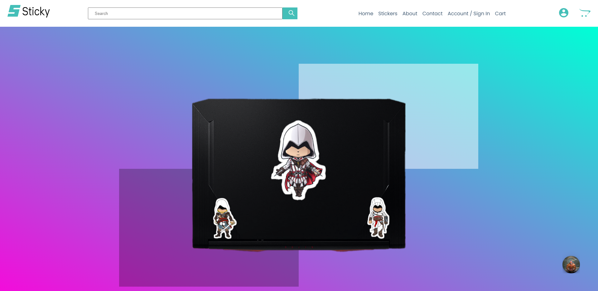
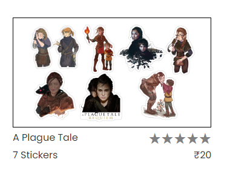
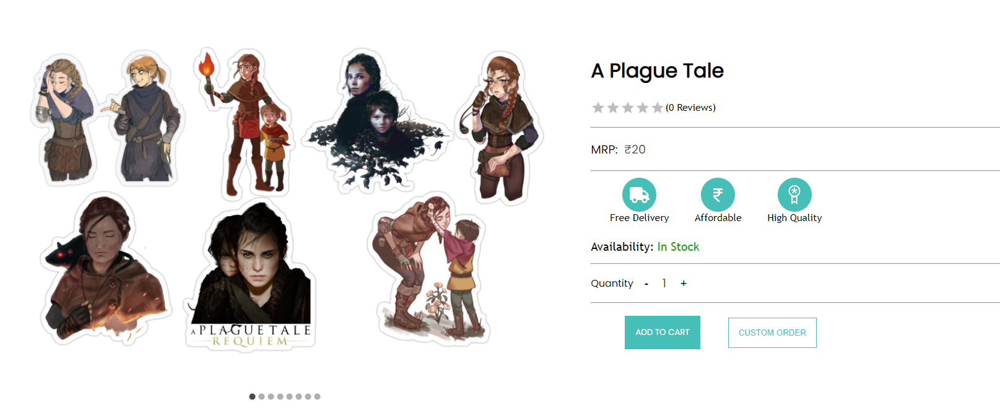
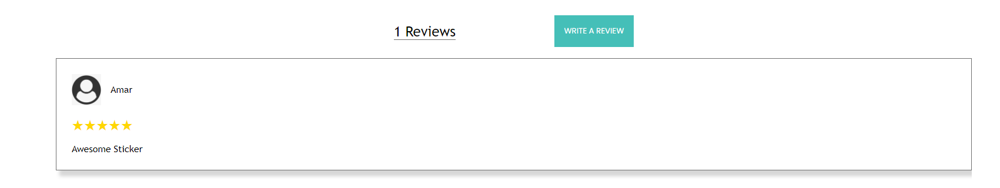
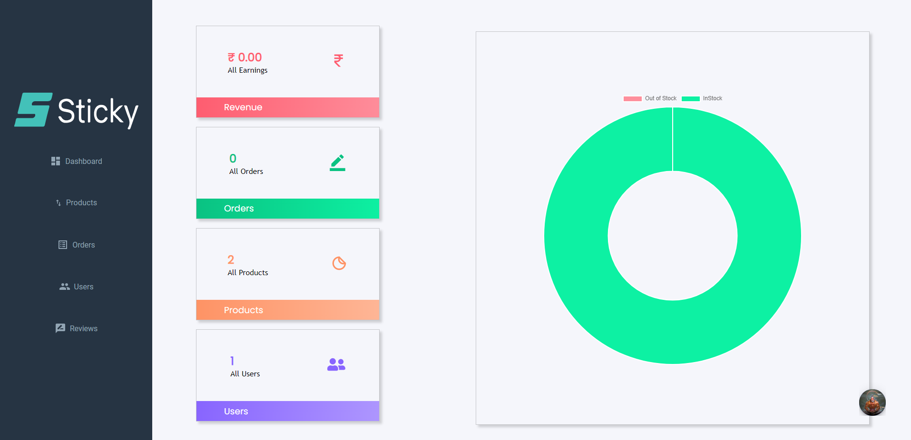
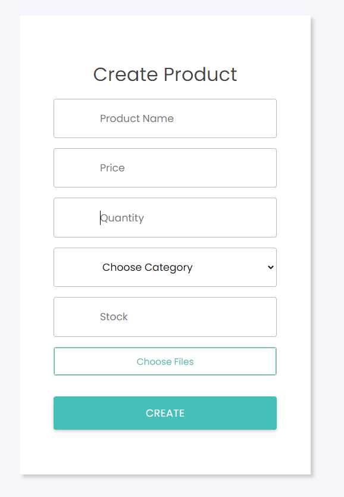
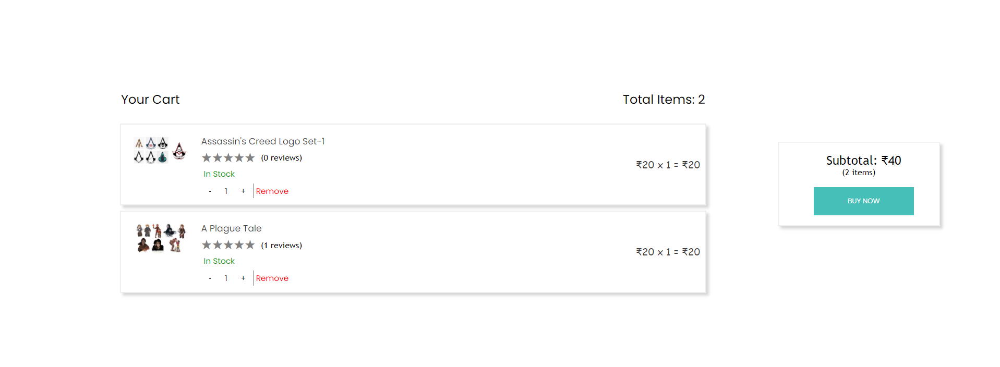

# STICKY
    A MERN Stack Ecommerce website for stickers. 

> Live demo [_here_](https://www.example.com). <!-- If you have the project hosted somewhere, include the link here. -->

## Table of Contents

- [Technologies Used](#technologies-used)
- [Features](#features)
- [Screenshots](#screenshots)
- [Project Status](#project-status)
- [Room for Improvement](#room-for-improvement)
- [Acknowledgements](#acknowledgements)
- [Contact](#contact)

## Technologies Used

To install Dependencies, use: npm i

- "@emotion/react": "^11.10.6",
- "@emotion/styled": "^11.10.6",
- "@material-ui/core": "^4.12.4",
- "@material-ui/data-grid": "^4.0.0-alpha.37",
- "@material-ui/icons": "^4.11.3",
- "@material-ui/lab": "^4.0.0-alpha.61",
- "@mui/icons-material": "^5.11.0",
- "@mui/material": "^5.11.8",
- "@mui/styled-engine-sc": "^5.11.11",
- "@mui/x-data-grid": "^6.0.0",
- "@stripe/react-stripe-js": "^1.16.4",
- "@stripe/stripe-js": "^1.46.0",
- "@testing-library/jest-dom": "^5.16.5",
- "@testing-library/react": "^13.4.0",
- "@testing-library/user-event": "^13.5.0",
- "axios": "^1.3.2",
- "chart.js": "^4.2.1",
- "country-state-city": "^3.1.2",
- "muibox": "^2.0.0",
- "react": "^18.2.0",
- "react-alert": "^7.0.3",
- "react-alert-template-basic": "^1.0.2",
- "react-chartjs-2": "^5.2.0",
- "react-confetti": "^6.1.0",
- "react-dom": "^18.2.0",
- "react-helmet": "^6.1.0",
- "react-icons": "^4.7.1",
- "react-img-hover-zoom": "^0.1.8",
- "react-js-pagination": "^3.0.3",
- "react-material-ui-carousel": "^2.3.11",
- "react-modal": "^3.16.1",
- "react-rating-stars-component": "^2.2.0",
- "react-redux": "^8.0.5",
- "react-router-dom": "^6.8.1",
- "react-scripts": "5.0.1",
- "react-use": "^17.4.0",
- "redux-devtools-extension": "^2.13.9",
- "redux-thunk": "^2.4.2",
- "styled-components": "^5.3.8",
- "web-vitals": "^2.1.4",
- "webfontloader": "^1.6.28"

## Features

- Order Stickers
- Custom Order Feature in which you can place the order of even that product which is not available on the website 
- Dashboard which gives you the full summary about what is happening in your store like how much earned, who are users, what orders they placed, in-stock and out-of-stock products etc.

## Screenshots

<!-- If you have screenshots you'd like to share, include them here. -->

## Project Status

Project is: _complete_ & _no longer being worked on_. 

## Room for Improvement

Room for improvement:

- Adding PayTm integration.
- Few Bugs to remove.

## Acknowledgements

- This project was inspired by 6 Pack Programmer.
- This project was based on [this tutorial](https://www.youtube.com/watch?v=AN3t-OmdyKA&t=55961s).
- Many thanks to 6 Pack Programmer.

## Contact

Created by [@Amar Jyoti](amarentp23@gmail.com) - feel free to contact me!